# Netflix Clone


## **Preface**

Here are some concepts that this repository will cover:

- JSX.
- React elements
- React components
- Firebase.
- useEffect.
- state.
- useState.
- props.
- React Router
- Event handling.
- Form handling.
- Synthetic events
- Communicate between components
- Deploy React to Firebase.

> Agenda:
>
> - Episode 1: Introduce the course, common rendering types, and import sample data to Firebase and understand React elements, React components by building Netflix's header component.
>
> - Episode 2: Create Row component, get data from Firebase, and understand about useEffect, props, state, useState by refactoring the Row component.
>
> - Episode 3: React Router to navigate between pages and create a "Sign In" page.
>
> - Episode 4: Summary knowledge and deploy the project to Firebase.

## **Table of Contents**

| No.   | Topics                                                                                                                                                             |
| ----- | ------------------------------------------------------------------------------------------------------------------------------------------------------------------ |
| 0     | [How to Run the Project.](#how-to-run-the-project)                                                                                                                 |
| 1     | [Live Demo.](#live-demo)                                                                                                                                           |
| 2     | [Prequisites.](#prequisites)                                                                                                                                       |
| 2.1   | [&nbsp;&nbsp;&nbsp;&nbsp;&nbsp;&nbsp;Softwares.](#softwares)                                                                                                       |
| 2.2   | [&nbsp;&nbsp;&nbsp;&nbsp;&nbsp;&nbsp;Technical Skills.](#technical-skills)                                                                                         |
| 2.3   | [&nbsp;&nbsp;&nbsp;&nbsp;&nbsp;&nbsp;Materials.](#materials)                                                                                                       |
| 3     | [Purposes of the Course.](#purposes-of-the-course)                                                                                                                 |
| 3.1   | [&nbsp;&nbsp;&nbsp;&nbsp;&nbsp;&nbsp;Final Project.](#final-project)                                                                                               |
| 3.2   | [&nbsp;&nbsp;&nbsp;&nbsp;&nbsp;&nbsp;Job.](#job)                                                                                                                   |
| 4     | [Common Rendering Types.](#common-rendering-types)                                                                                                                 |
| 4.1   | [&nbsp;&nbsp;&nbsp;&nbsp;&nbsp;&nbsp;Server Side Rendring.](#server-side-rendering)                                                                                |
| 4.1.1 | [&nbsp;&nbsp;&nbsp;&nbsp;&nbsp;&nbsp;&nbsp;&nbsp;&nbsp;&nbsp;&nbsp;&nbsp;How Server Side Rendering Work.](#how-server-side-rendering-work)                         |
| 4.1.2 | [&nbsp;&nbsp;&nbsp;&nbsp;&nbsp;&nbsp;&nbsp;&nbsp;&nbsp;&nbsp;&nbsp;&nbsp;The Advantages of Server Side Rendering.](#the-advantages-of-server-side-rendering)       |
| 4.1.3 | [&nbsp;&nbsp;&nbsp;&nbsp;&nbsp;&nbsp;&nbsp;&nbsp;&nbsp;&nbsp;&nbsp;&nbsp;The Disadvantages of Server Side Rendering.](#the-disadvantages-of-server-side-rendering) |
| 4.2   | [&nbsp;&nbsp;&nbsp;&nbsp;&nbsp;&nbsp;Client Side Rendring & Single Page Application.](#client-side-rendering-and-single-page-application)                          |
| 4.2.1 | [&nbsp;&nbsp;&nbsp;&nbsp;&nbsp;&nbsp;&nbsp;&nbsp;&nbsp;&nbsp;&nbsp;&nbsp;How Client Side Rendering Work.](#how-client-side-rendering-work)                         |
| 4.2.2 | [&nbsp;&nbsp;&nbsp;&nbsp;&nbsp;&nbsp;&nbsp;&nbsp;&nbsp;&nbsp;&nbsp;&nbsp;The Advantages of Client Side Rendering.](#the-advantages-of-client-side-rendering)       |
| 4.2.3 | [&nbsp;&nbsp;&nbsp;&nbsp;&nbsp;&nbsp;&nbsp;&nbsp;&nbsp;&nbsp;&nbsp;&nbsp;The Disadvantages of Client Side Rendering.](#the-disadvantages-of-client-side-rendering) |
| 5     | [Introduction about React.](#introduction-about-react)                                                                                                             |
| 5.1   | [&nbsp;&nbsp;&nbsp;&nbsp;&nbsp;&nbsp;What.](#what)                                                                                                                 |
| 5.2   | [&nbsp;&nbsp;&nbsp;&nbsp;&nbsp;&nbsp;Why & Advantages.](#why-and-advantages)                                                                                       |
| 5.3   | [&nbsp;&nbsp;&nbsp;&nbsp;&nbsp;&nbsp;When & Disadvantages.](#when-and-disadvantages)                                                                               |
| 5.4   | [&nbsp;&nbsp;&nbsp;&nbsp;&nbsp;&nbsp;How.](#how)                                                                                                                   |
| 5.5   | [&nbsp;&nbsp;&nbsp;&nbsp;&nbsp;&nbsp;What Makes React so Fast.](#what-makes-react-so-fast)                                                                         |
| 6     | [Building Netflix.](#building-netflix)                                                                                                                             |
| 6.1   | [&nbsp;&nbsp;&nbsp;&nbsp;&nbsp;&nbsp;How to Import Sample Data to Firebase.](#how-to-import-sample-data-to-firebase)                                               |
| 6.2   | [&nbsp;&nbsp;&nbsp;&nbsp;&nbsp;&nbsp;Create Web Application on Firebase.](#create-web-application-on-firebase)                                                     |
| 6.3   | [&nbsp;&nbsp;&nbsp;&nbsp;&nbsp;&nbsp;Prequesites.](#netflix-prequesites)                                                                                           |
| 6.4   | [&nbsp;&nbsp;&nbsp;&nbsp;&nbsp;&nbsp;Build Header - Home Page.](#build-header-home-page)                                                                           |
| 6.5   | [&nbsp;&nbsp;&nbsp;&nbsp;&nbsp;&nbsp;Build Row - Home Page.](#build-row-home-page)                                                                                 |
| 6.6   | [&nbsp;&nbsp;&nbsp;&nbsp;&nbsp;&nbsp;Apply React Router.](#apply-react-router)                                                                                     |
| 6.7   | [&nbsp;&nbsp;&nbsp;&nbsp;&nbsp;&nbsp;Set Up Firebase Authentication.](#set-up-firebase-authentication)                                                             |
| 6.8   | [&nbsp;&nbsp;&nbsp;&nbsp;&nbsp;&nbsp;Build Netflix Login Page.](#build-netflix-login-page)                                                                         |
| 7     | [Deploy React to Firebase.](#deploy-react-to-firebase)                                                                                                             |
| 8     | [Summary.](#summary)                                                                                                                                               |
| 9     | [Useful Resources.](#useful-resources)                                                                                                                             |
| 10    | [References.](#references)                                                                                                                                         |

<a id="how-to-run-the-project"></a>

## **0. How to Run the Project.**

- Step 1: Clone the project by using git clone or download the zip file.

- Step 2: Open "terminal" / "cmd" / "gitbash" and change directory to "source" and run "npm install" to install dependencies.

- Step 3: Run "npm start" to run the fron-end project.

<a id="live-demo"></a>

## **1. Live Demo.**

// TODO

<a id="prequisites"></a>

## **2. Prequisites.**

<a id="softwares"></a>

### **2.1. Softwares.**

- Install NodeJS.

- An IDE or a text editor (VSCode, Intellij, Webstorm, etc).

<a id="technical-skills"></a>

### **2.2. Technical Skills.**

- Basic programming skill.

- Basic HTML, CSS, JS skills.

<a id="materials"></a>

### **2.3. Materials.**

- Html, CSS, js (source code) was prepared because I want to focus on React and share knowledge about React. Building HTML and CSS from scratch would take a lot of time.

- README.md (the MD file will contain everything about the course).

- Netflix data will be used to import to Firebase. In this course, we use Firebase as our back-end service.

<a id="purposes-of-the-course"></a>

## **3. Purposes of the Course.**

<a id="final-project"></a>

### **3.1. Final Project.**

- The course would help you have an understanding of React.

- You could build the final project with an end-to-end solution (front-end solution using React and back-end solution using Firebase).

<a id="job"></a>

### **3.2. Job.**

- After finishing the course, you could get a job in a fresher / junior position.

<a id="common-rendering-types"></a>

## **4. Common Renderting Types.**

<a id="server-side-rendering"></a>

### **4.1 Server Side Rendering.**

<a id="how-server-side-rendering-work"></a>

#### **4.1.1. How Server Side Rendering Work.**

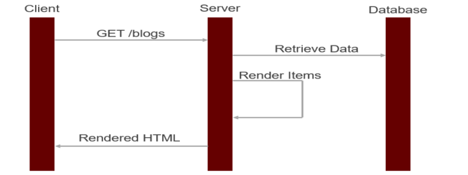

- When a user accesses the website. The request would be sent to the server.

- The web server would receive the request and connect to the database.

- The web server would render HTML and return the result to the end-user.

<a id="the-advantages-of-server-side-rendering"></a>

#### **4.1.2 The Advantages of Server Side Rendering.**

- The initial loading time will be fast. Because almost all of the things will be handled on the server-side.

- It is supported by many frameworks (Node.js, Java, PHP, .NET, etc).

- It is easy to understand because the developers do not need to separate front-end and back-end.
- It is good for SEO.

<a id="the-disadvantages-of-server-side-rendering"></a>

#### **4.1.3 The Disadvantages of Server Side Rendering.**

- When the user navigates between pages. The entire page has to be loaded again.

- The server side has to handle many things (connecting to the database, rendering HTML, etc).

- It consumes more bandwidth because the server returns the same content many times (header, footer, etc).

<a id="client-side-rendering-and-single-page-application"></a>

### **4.2 Client Side Rendering & Single Page Application.**

<a id="how-client-side-rendering-work"></a>

#### **4.2.1. How Client Side Rendering Work.**


- Rendering HTML, CSS will be handled on the browser by Javascript.

<a id="the-advantages-of-client-side-rendering"></a>

#### **4.2.2. The Advantages of Client Side Rendering.**

- The page would be loaded just once.

- Javascript code would interact with the back-end APIs to get data.

- Business logic could be handled on the client side. Hence, the server does not need to handle all of the business features.

- Reducing the bandwidth because the applications just need to get JSON data instead of loading the entire page.

- It provides better UX.

<a id="the-disadvantages-of-client-side-rendering"></a>

#### **4.2.3. The Disadvantages of Client Side Rendering.**

- The initial loading time will be slow. Because the browser has to load Javascript code, get data from the server, parse and render data.

- The project will be separated into front-end and back-end.

- The application could not be run if Javascript is disabled on the browser.

- It is not good for SEO.

- The load time would be slow for old devices.

<a id="introduction-about-react"></a>

## **5. Introduction about React.**

<a id="what"></a>

### **5.1. What.**

- React is a front-end open source library. It will be used to build SPA (Single Page Application).

- React Native can be used to build mobile applications which have the ability to run on both IOS and Android.

- React was created by Jordan Walke - a software engineer for Facebook.

- React was first deployed on Facebook's New Feeds in 2011 and on Instagram in 2012.

<a id="why-and-advantages"></a>

### **5.2 Why & Advantages.**

- React has a Virtual DOM concept so that it provides good performance.

- React supports server-side rendering.

- React supports one-way data flow.

- React helps the developer create reusable components.

<a id="when-and-disadvantages"></a>

### **5.3. When & Disadvantages.**

- React is just a view library, not a full framework.

- There is a curve for beginners.

- Integrating React with MVC traditional frameworks will need
  some configuration.

- The code complexity will be increased.

- Your application may contain too many smaller components.

<a id="how"></a>

### **5.4. How.**

- Step 1: Install Node.js.

- Step 2: Run 'npx create-react-app appName'. (appName could be replaced by the application's name).

<a id="what-makes-react-so-fast"></a>

### **5.5. What Makes React so Fast.**

- The answer is Virtual DOM.

- There is a process which is called reconciliation.

1. Whenever any underlying data changes, the entire UI is re-rendered in Virtual DOM representation.

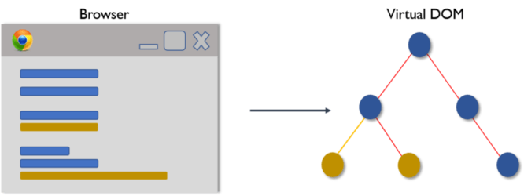

2. The differences between the Virtual DOM and the Real DOM are calculated.


3. The Real DOM will be updated with only the things that have actually changed.


<a id="building-netflix"></a>

## **6. Building Netflix.**

<a id="how-to-import-sample-data-to-firebase"></a>

### **6.1. How to Import Sample Data to Firebase.**

- Step 1: Access the browser, go to https://firebase.google.com and click on the "Sign in" button.


- Step 2: Sign in to Firebase by using a Gmail account, input the user's name and password and then click on the "Next" button.


- Step 3: Click on "Go to Console" button.


- Step 4: Click on the "Create a project" button to create the Firebase project.


- Step 5: Input project's name (example: 'netflix-clone') and then click on "Continue" button.


- Step 6: Click on the "Continute" button.

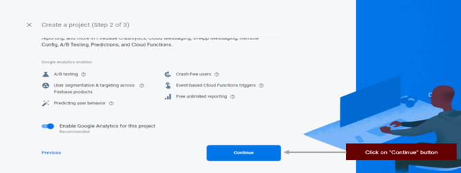

- Step 7: Select the account. You could select your Gmail account and then click on the "Create Project" button.

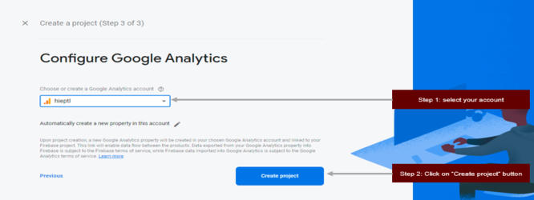

- Step 8: In this step, Firebase would handle the remaining tasks for you and you wait until everything has been set up successfully.


- Step 9: Click on "Continue" button.

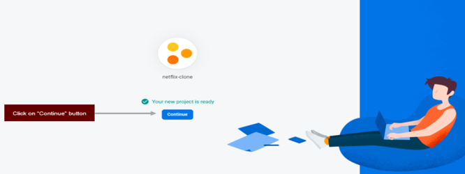

- Step 10: At the dashboard page, you click the "Realtime Database" option. It means that when you change your data, your data on the web application will be updated automatically without refreshing the page.


- Step 11: It's time to create a database by clicking on the "Create Database" button.

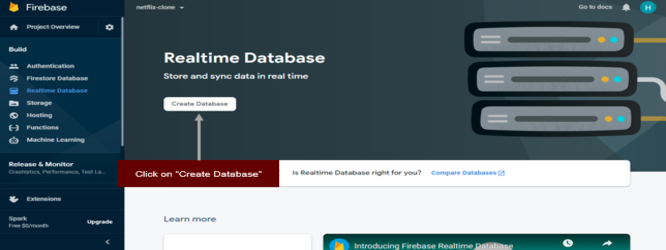

- Step 12: Select the real-time database's location (just need to choose the default one) and then click on the "Next" button.

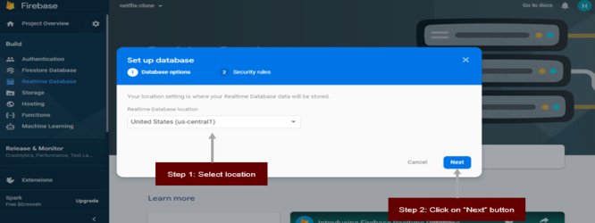

- Step 13: Configure security rules for the database. You select test mode because the database is used for demo purposes and click on the "Enable" button.

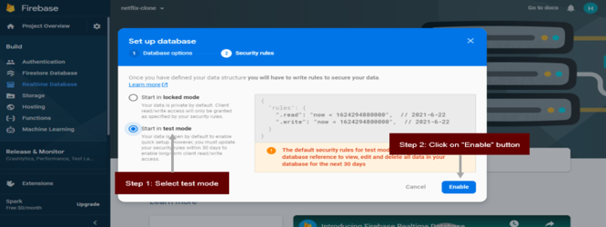

- Step 14: Click on the "Import JSON" option.

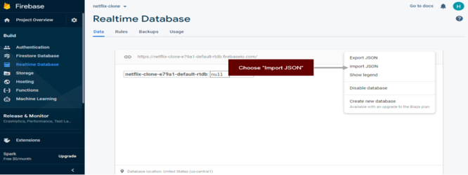

- Step 15: Select "data.json" from the git repository and click on the "Import" button.

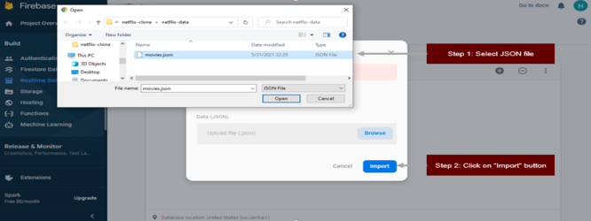

- Step 16: After importing successfully, your result should be like this.

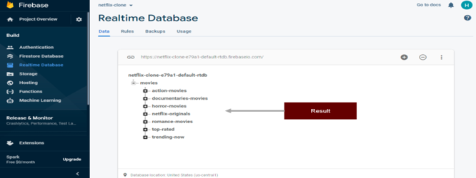

<a id="create-web-application-on-firebase"></a>

### **6.2. Create Web Application on Firebase.**

After creating the real-time database and importing sample data to Firebase, a web application should be created on Firebase. Firebase would return the configuration information. That information will be used later.

- Step 1: Click on the "setting" icon and choose the "Project settings" option.

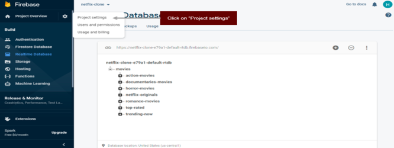

- Step 2: Scroll down to the bottom of the page and choose the "web" icon.


- Step 3: Input "App nickname" (example: "netflix-clone") and click on "Register App" button.

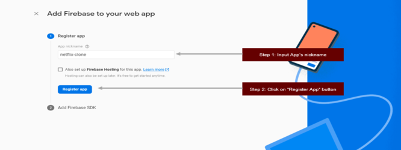

- Step 4: Save Firebase configuration somewhere else for later use and click on the "Continue to Console" button.

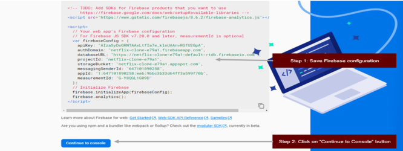

<a id="prequesites"></a>

### **6.3. Prequesites.**

- Step 1: Imported data.json (in the data folder) to Firebase. We will use that data to build a Netflix application.

- Step 2: Created the web application on Firebase to get Firebase configuration.

- Step 3: Created a project with name 'netflix-clone' by running 'npx create-react-app netflix-clone'.

- Step 4: Replaced the content of styles.css (in the ui folder) to index.css so that we do not need to worry about CSS.

<a id="build-header-home-page"></a>

### **6.4. Build Header - Home Page.**


The following steps describe how to build Netflix's header.

- Step 1: Replace the content of App.js with the following code, open "cmd" or "terminal" or "git-bash", change the directory to your project's folder and run "npm start" to launch the project.

```js
function App() {
  return (
    <div className="app">
      {/* Nav */}
      <div className="nav false">
        
        
      </div>
      {/* End Nav */}
      {/* Header */}
      <header className="banner">
        <div className="banner__contents">
          <h1 className="banner__title">Ginny &amp; Georgia</h1>
          <div className="banner__buttons">
            <button className="banner__button">Play</button>
            <button className="banner__button">My List</button>
          </div>
          <h1 className="banner__description">
            Angsty and awkward fifteen year old Ginny Miller often feels more
            mature than her thirty year old mother, the irresistible and dynamic
            Georgia Miller...
          </h1>
        </div>
        <div className="banner--fadeBottom"></div>
      </header>
      {/* Header */}
    </div>
  );
}

export default App;
```

> 1st NOTE:
>
> - What inside return () is called React Element.
>
> - React Element describes what would be appeared on the screen.
>
> - React Element is cheap.
>
> - Once React Element is created, they never are mutated.
>
> - As mentioned above, we are writing Javascript along with HTML, we can do that because React provides the concept of JSX (Javascript XML).

> 2nd NOTE:
>
> - If you run the code, Netflix's header would have appeared.
>
> - However, we can break down Netflix's header into smaller components to reuse them and it would be easy to maintain.
>
> - Components are small UI pieces that will be combined to build your application.
>
> - You can imagine you are playing Lego.


- Step 2: Create a "components" folder." components" folder will be used to store components in your application. We should not put everything in the src folder, structuring projects helps the developers scale and maintain code easier.

- Step 3: Create Nav.js file in "components/nav" folder with the following code.

```js
function Nav() {
  return (
    <div className="nav false">
      
      
    </div>
  );
}

export default Nav;
```

- Step 4: Create Header.js file in "components/header" folder with the following code.

```js
function Header() {
  return (
    <header className="banner">
      <div className="banner__contents">
        <h1 className="banner__title">Ginny &amp; Georgia</h1>
        <div className="banner__buttons">
          <button className="banner__button">Play</button>
          <button className="banner__button">My List</button>
        </div>
        <h1 className="banner__description">
          Angsty and awkward fifteen year old Ginny Miller often feels more
          mature than her thirty year old mother, the irresistible and dynamic
          Georgia Miller...
        </h1>
      </div>
      <div className="banner--fadeBottom"></div>
    </header>
  );
}

export default Header;
```

- Step 5: Change your App.js with the following code.

```js
import Nav from "./components/nav/Nav";
import Header from "./components/header/Header";

function App() {
  return (
    <div className="app">
      {/* Nav */}
      <Nav />
      {/* End Nav */}
      {/* Header */}
      <Header />
      {/* Header */}
    </div>
  );
}

export default App;
```

> 3rd NOTE:
>
> - Now you can see the result would be the same.
>
> - You can reuse the Nav component and Header component in different places in your application.
>
> - It is one of the advantages of React library - create reusable components.

<a id="build-row-home-page"></a>

### **6.5. Build Row - Home Page**


The above image mentions the similarities between rows in the home page. They also have a title element and a list of movies element. Therefore, a "Row" component should be created for reusable.

The following steps describe how to build the "Row" component.

- Step 1: Like what we have done with the Nav component and Header component, you create a Row.js file in the "components/row folder with the following code.

```js
function Row() {
  return (
    <div class="row">
      <h2>NETFLIX ORGINALS</h2>
      <div class="row__posters">
        
        
        
        
        
        
        
        
        
        
        
        
        
        
        
        
        
        
        
        
      </div>
    </div>
  );
}

export default Row;
```

> 4th NOTE:
>
> - In case, we have to create different rows with different data (images, title, and so on), we have to duplicate this component to many "Row" components.
>
> - As mentioned before, **the component should be reusable**. It means that we need to make the current "Row" component be reusable instead of creating a new one.

> 5th NOTE:
>
> - We are hardcoding the data in the "Row" component.
>
> - We need to get some real data to make the application be realistic.
>
> - In this course, we need to know how to integrate with Firebase first, and then we will come back to our "Row" component later.

- Step 4: Install Firebase package from npm by running 'npm install --save firebase".

- Step 5: Create "firebase" inside the src folder.

- Step 6: Create a "firebase.js" file inside the "firebase" folder with the following content.

```js
import firebase from "firebase";

const app = firebase.initializeApp({
  apiKey: "apiKey",
  authDomain: "projectId.firebaseapp.com",
  // For databases not in the us-central1 location, databaseURL will be of the
  // form https://[databaseName].[region].firebasedatabase.app.
  // For example, https://your-database-123.europe-west1.firebasedatabase.app
  databaseURL: "https://databaseName.firebaseio.com",
  storageBucket: "bucket.appspot.com",
});

const firebaseDatabase = app.database();

export { firebaseDatabase };
```

> 6th NOTE:
>
> - Replace "apiKey" with your API key.
>
> - Replace "projectId.firebaseapp.com" with your auth domain.
>
> - Replace "https://databaseName.firebaseio.com" with your database URL.
>
> - Replace "bucket.appspot.com" with your storage bucket.

- Step 7: In fact, we should store credentials in a .env file (environment file). Env file should not be committed to your git repository. Therefore, you need to create a .env file in your root folder with the following content.

```js
REACT_APP_FIREBASE_API_KEY = xxx - xxx - xxx - xxx - xxx;
REACT_APP_FIREBASE_AUTH_DOMAIN = xxx - xxx - xxx - xxx - xxx;
REACT_APP_FIREBASE_DATABASE_UTL = xxx - xxx - xxx - xxx - xxx;
REACT_APP_FIREBASE_STORAGE_BUCKET = xxx - xxx - xxx - xxx - xxx;
```

> 7th NOTE:
>
> - The prefix of your environment variables must be "REACT_APP".

- Step 8: After creating the .env file, we need to replace the content of the firebase.js file with the following content.

```js
import firebase from "firebase";

const app = firebase.initializeApp({
  apiKey: `${process.env.REACT_APP_FIREBASE_API_KEY}`,
  authDomain: `${process.env.REACT_APP_FIREBASE_AUTH_DOMAIN}`,
  // For databases not in the us-central1 location, databaseURL will be of the
  // form https://[databaseName].[region].firebasedatabase.app.
  // For example, https://your-database-123.europe-west1.firebasedatabase.app
  databaseURL: `${process.env.REACT_APP_FIREBASE_DATABASE_UTL}`,
  storageBucket: `${process.env.REACT_APP_FIREBASE_STORAGE_BUCKET}`,
});

const firebaseDatabase = app.database();

export { firebaseDatabase };
```

- Step 9: Import "firebase database" from the "firebase.js" file and write a function in the "Row" component to get data from Firebase.

```js
...
import { firebaseDatabase } from "../../firebase/firebase";

function Row() {
  ...
  const leafRoot = 'movies';
  const fetchMovies = (movieType) => {
    const movieRef = firebaseDatabase.ref(`${leafRoot}/${movieType}`);
    movieRef.on("value", (snapshot) => {
      const movies = snapshot.val();
      if (movies && movies.length !== 0) {
        setMovies(() => movies);
      }
    });
  };
  ...
}
...
```

> 8th NOTE:
>
> - Where do we call the above function in the "Row" component?
>
> - The best practice is to call the function after the component has been loaded. How do we know when the component has been loaded?
>
> - React provides **"useEffect"** to help us. **"useEffect"** is one of the built-in React hooks.

- Step 10: Import useEffect in the "Row" component.

```js
import { useEffect } from "react";
```

- Step 11: Call fetchMovies function in useEffect.

```js
useEffect(() => {
  fetchMovies(movieType);
}, []);
```

> 9th NOTE:
>
> - Wait a minute! What is "movieType" ??? We did not define it before.
>
> - Please do not worry, we will explain in detail why do we need "movieType" here. Firstly, please keep in mind that **we always want to make the "Row" component be reusable**.
>
> - For this reason, we should let the person who is using our "Row" component define the movie type that he/she wants to get from Firebase instead of hardcoding it in the "Row" component.
>
> - We want something like this.
>
> ```js
> <Row title='Netflix Originals' movieType='netflix-originals' />
> <Row title='Trending Now' movieType='trending-now' />
> <Row title='Top Rated' movieType='top-rated' />
> <Row title='Action Movies' movieType='action-movies' />
> <Row title='Horror Movies' movieType='horror-movies' />
> <Row title='Romance Movies' movieType='romance-movies' />
> <Row title='Documentaries Movies' movieType='documentaries-movies' />
> ```

> 10th NOTE:
>
> - It is time for "props" to come to play.
>
> - "props" stands for properties.
>
> - "props" could be a single value or an object.
>
> - "props" would be passed from the parent component to the child component.
>
> - We can imagine the "props" object is similar to the function's parameters.

- Step 12: Define props as the parameter for the Row function.

```js
function Row(props) {...}
```

- Step 13: Get the value that will be passed from other components and use them in our application.

```js
const { title, movieType } = props;
...
useEffect(() => {
  fetchMovies(movieType);
}, []);
...
<h2>{title}</h2>
```

- Step 14: Pass custom data from the "App" component to the "Row" component with the following code.

```js
<Row title="Netflix Originals" type="netflix-originals" />
<Row title='Netflix Originals' movieType='netflix-originals' />
<Row title='Trending Now' movieType='trending-now' />
<Row title='Top Rated' movieType='top-rated' />
<Row title='Action Movies' movieType='action-movies' />
<Row title='Horror Movies' movieType='horror-movies' />
<Row title='Romance Movies' movieType='romance-movies' />
<Row title='Documentaries Movies' movieType='documentaries-movies' />
```

> 11th NOTE:
>
> - We are almost done! The question is how to display the list of movies on JSX after getting data from Firebase.
>
> - We need to find a way to store the data and make the component be re-rendered after we have movies from Firebase.
>
> - Fortunately, React provides **useState** to help us achieve that.

> 12th NOTE:
>
> - State is an object that holds information that may be changed over the lifetime of the component.
>
> - It is private and fully controlled by the component.

- Step 15: We need to import the "estate" in the "Row" component to define the movie's state.

```js
import { useEffect, useState } from "react";
```

- Step 16: Define the "movies" state to store the list of movies after getting data from Firebase.

```js
function Row(props) {
  ...
  const [movies, setMovies] = useState([]);
  ...
}
```

- Step 17: Update the "fetchMovies" function to put data to the state.

```js
const fetchMovies = (movieType) => {
  const movieRef = firebaseDatabase.ref(`${leafRoot}/${movieType}`);
  movieRef.on("value", (snapshot) => {
    const movies = snapshot.val();
    if (movies && movies.length !== 0) {
      // update "movies" state by calling "setMovies" function.
      setMovies(() => movies);
    }
  });
};
```

> 13th NOTE:
>
> - In case, we have data in the "movies" state, the question is how to display the list of movies on JSX. Because we are displaying a long list of hardcoding image tags.
> - We can use the map() function in Javascript to display the list of data on JSX.

- Step 18: Display data in "movie" state on JSX by using map() function.

```js
function Row(props) {
  ...
  return (
    <div className="row">
      <h2>{title}</h2>
      <div className="row__posters">
        {movies.map((movie) => (
          
        ))}
      </div>
    </div>
  );
  ...
}
```

- Step 19: Let's combine everything together.

Row.js

```js
import { useEffect, useState } from "react";

import { firebaseDatabase } from "../../firebase/firebase";

function Row(props) {
  const [movies, setMovies] = useState([]);

  const { title, movieType } = props;

  const leafRoot = "movies";

  useEffect(() => {
    fetchMovies(movieType);
  }, []);

  const fetchMovies = (movieType) => {
    const movieRef = firebaseDatabase.ref(`${leafRoot}/${movieType}`);
    movieRef.on("value", (snapshot) => {
      const movies = snapshot.val();
      if (movies && movies.length !== 0) {
        setMovies(() => movies);
      }
    });
  };

  return (
    <div className="row">
      <h2>{title}</h2>
      <div className="row__posters">
        {movies.map((movie) => (
          
        ))}
      </div>
    </div>
  );
}

export default Row;
```

App.js

```js
import Nav from "./components/nav/Nav";
import Header from "./components/header/Header";
import Row from "./components/row/Row";

function App() {
  return (
    <div className="app">
      {/* Nav */}
      <Nav />
      {/* End Nav */}
      {/* Header */}
      <Header />
      {/* Header */}
      {/* Row */}
      <Row title="Netflix Originals" movieType="netflix-originals" />
      <Row title="Trending Now" movieType="trending-now" />
      <Row title="Top Rated" movieType="top-rated" />
      <Row title="Action Movies" movieType="action-movies" />
      <Row title="Horror Movies" movieType="horror-movies" />
      <Row title="Romance Movies" movieType="romance-movies" />
      <Row title="Documentaries Movies" movieType="documentaries-movies" />
      {/* End Row */}
    </div>
  );
}

export default App;
```

<a id="apply-react-router"></a>

## **6.6. Apply React Router.**

The Netflix application may contain many pages, not just the home page. Hence, we should find an efficient way to navigate between pages in our React application. **React Router** is a powerful routing library that can help us to achieve that.

The following steps will demonstrate how to integrate React Router in our Netflix application and how we re-structure our components to support navigating between pages:

- Step 1: Install "react-router-dom" library by running "npm install --save react-router-dom".

> 14th NOTE:
>
> - We are writing code to build the home page in the App.js file.
>
> - In fact, we should not do that. We should create a "Home" component to store the code of the home page.
>
> - App.js should be used to store common information of the application such as routing, common components (navbar, header, footer, etc), and so on.
>
> - The diagram below demonstrates what our "Home" component looks like.
>
> 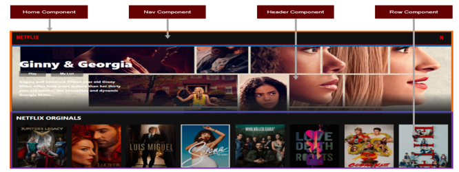

- Step 2: Create a Home.js file in the "components" folder with the following code.

```js
import Nav from "../nav/Nav";
import Header from "../header/Header";
import Row from "../row/Row";

function Home() {
  return (
    <div className="app">
      {/* Nav */}
      <Nav />
      {/* End Nav */}
      {/* Header */}
      <Header />
      {/* Header */}
      {/* Row */}
      <Row title="Netflix Originals" movieType="netflix-originals" />
      <Row title="Trending Now" movieType="trending-now" />
      <Row title="Top Rated" movieType="top-rated" />
      <Row title="Action Movies" movieType="action-movies" />
      <Row title="Horror Movies" movieType="horror-movies" />
      <Row title="Romance Movies" movieType="romance-movies" />
      <Row title="Documentaries Movies" movieType="documentaries-movies" />
      {/* End Row */}
    </div>
  );
}

export default Home;
```

- Step 3: Update the App.js file with the following code.

```js
import { BrowserRouter as Router, Switch, Route } from "react-router-dom";

import Home from "./components/home/Home";

function App() {
  return (
    <Router>
      <Switch>
        <Route exact path="/">
          <Home />
        </Route>
      </Switch>
    </Router>
  );
}

export default App;
```

> 15th NOTE:
>
> - If you run the application, the result will be the same.
>
> - As mentioned above, App.js should store common information of the application. In this case, it stores information about routing.
>
> - "Switch" component is similar to the switch-case in programming. According to the example above, the application will show the home page to the end-user if the current route is '/'
>
> - Following that, we can define many routes in the App.js file and specify the corresponding component for each route. We will do that in the following section.

<a id="set-up-firebase-authentication"></a>

## **6.7. Set Up Firebase Authentication.**

Before building the login page, we need to set up Firebase Authentication first. Different sign-in methods could be integrated into the application. In this course, we will choose the "Email/Password" sign-in method. The following steps will describe how to set up that method in Firebase.

- Step 1: Click on the "Authentication" option.

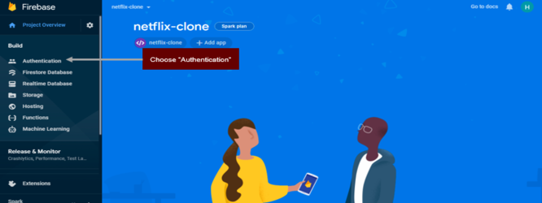

- Step 2: Click on the "Get started" button.

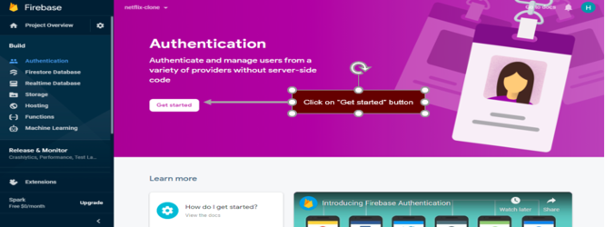

- Step 3: Choose the "Sign-in method" tab.

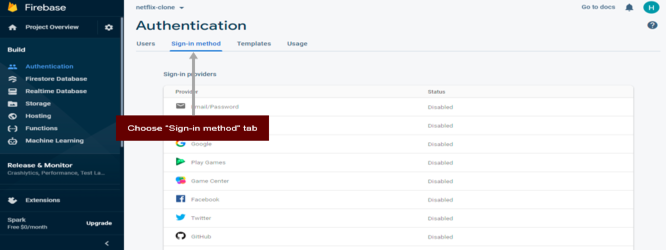

- Step 4: Click on the "Edit" icon on the "Email/Password" row.


- Step 5: Click on the "Enable" toggle button and click on the "Save" button.

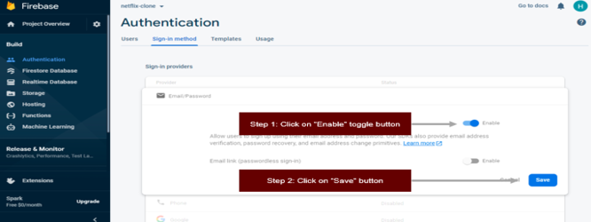

- Step 6: Set up an account for use later, choose the "Users" tab, and click on the "Add User" button.


- Step 7: Input the user's name and password and click on the "Add User" button.

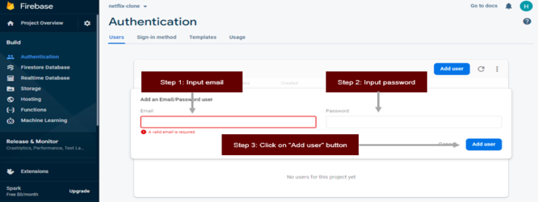

- Step 8: After creating a new user successfully, your result should be like this.

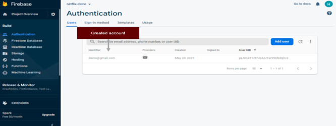

- Step 9: We need to update the "firebase.js" file for later use with the following code.

```js
import firebase from "firebase";

const app = firebase.initializeApp({
  apiKey: `${process.env.REACT_APP_FIREBASE_API_KEY}`,
  authDomain: `${process.env.REACT_APP_FIREBASE_AUTH_DOMAIN}`,
  // For databases not in the us-central1 location, databaseURL will be of the
  // form https://[databaseName].[region].firebasedatabase.app.
  // For example, https://your-database-123.europe-west1.firebasedatabase.app
  databaseURL: `${process.env.REACT_APP_FIREBASE_DATABASE_UTL}`,
  storageBucket: `${process.env.REACT_APP_FIREBASE_STORAGE_BUCKET}`,
});

const firebaseDatabase = app.database();
const firebaseAuth = app.auth();

export { firebaseDatabase, firebaseAuth };
```

<a id="build-netflix-login-page"></a>

## **6.8. Build Netflix Login Page.**

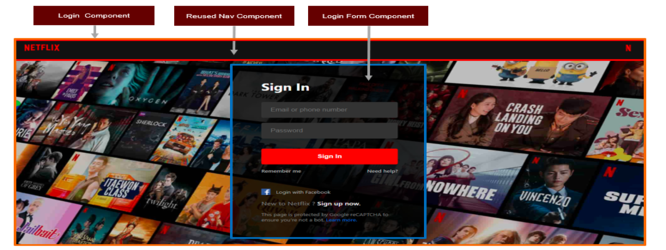

The above image describes how the login page is separated into smaller components. In this case, we have a wrapper component which is called the "Login" component. On the other hand, the "Nav" component can be reused and the "Login Form" component should be created to create a sign-in form. The following steps will help us achieve that step by step.

- Step 1: Create LoginForm.js in the "component/login" folder with the following code.

```js
function LoginForm() {
  return (
    <div className="login-body">
      <div className="login-body__form">
        <h1>Sign In</h1>
        <div className="login-body__input mb-16">
          <input type="text" placeholder="Email or phone number" />
        </div>
        <div className="login-body__input">
          <input type="password" placeholder="Password" />
        </div>
        <button className="login-body__submit-btn">Sign In</button>
        <div className="login-body__options">
          <span>Remember me</span>
          <span className="login-body__need-help">Need help?</span>
        </div>
        <div className="login-body__footer">
          <div className="login-body__fb">
            
            <span>Login with Facebook</span>
          </div>
          <div className="login-body__new-to-nl">
            <span>New to Netflix ?</span>
            <span className="login-body__sign-up">Sign up now.</span>
          </div>
          <div className="login-body__google_captcha">
            This page is protected by Google reCAPTCHA to ensure you're not a
            bot.
            <span className="login-body__learn-more">Learn more.</span>
          </div>
        </div>
      </div>
    </div>
  );
}

export default LoginForm;
```

- Step 2: Create Login.js file in "components/login" folder with the following code.

```js
import Nav from "../nav/Nav";
import LoginForm from "./LoginForm";

function Login() {
  return (
    <div className="main">
      {/* Nav */}
      <Nav />
      {/* End Nav */}
      {/* Login Form */}
      <LoginForm />
      {/* End Login Form */}
    </div>
  );
}

export default Login;
```

> 16th NOTE:
>
> - The best part is about the "Nav" component can be reused without creating a new one. It is one of the advantages of React and component-based UI.
>
> - The login component was created. However, how the end-user can use it in the web application. We need to set up a new route in App.js so that the end-user can access that route and use the login page.

- Step 3: Add "/login" route in App.js. App.js should look like this.

```js
import { BrowserRouter as Router, Switch, Route } from "react-router-dom";

import Home from "./components/home/Home";
import Login from "./components/login/Login";

function App() {
  return (
    <Router>
      <Switch>
        <Route exact path="/">
          <Home />
        </Route>
        <Route exact path="/login">
          <Login />
        </Route>
      </Switch>
    </Router>
  );
}

export default App;
```

> 17th NOTE:
>
> - If you run the project and access the '/login' route, you can see the login page.
>
> - We have finished dividing the login page into smaller components. The next part is how to detect when the current user clicks on the "Sign In" button.

- Step 4: Replace the "Login Form" component with the following code.

```js
function LoginForm() {
  const login = () => {
    console.log("Sign in button was click");
  };

  return (
    <div className="login-body">
      <div className="login-body__form">
        <h1>Sign In</h1>
        <div className="login-body__input mb-16">
          <input type="text" placeholder="Email or phone number" />
        </div>
        <div className="login-body__input">
          <input type="password" placeholder="Password" />
        </div>
        <button className="login-body__submit-btn" onClick={login}>
          Sign In
        </button>
        <div className="login-body__options">
          <span>Remember me</span>
          <span className="login-body__need-help">Need help?</span>
        </div>
        <div className="login-body__footer">
          <div className="login-body__fb">
            
            <span>Login with Facebook</span>
          </div>
          <div className="login-body__new-to-nl">
            <span>New to Netflix ?</span>
            <span className="login-body__sign-up">Sign up now.</span>
          </div>
          <div className="login-body__google_captcha">
            This page is protected by Google reCAPTCHA to ensure you're not a
            bot.
            <span className="login-body__learn-more">Learn more.</span>
          </div>
        </div>
      </div>
    </div>
  );
}

export default LoginForm;
```

> 18th NOTE:
>
> - In the code above, "onClick={login}" was added to the "Sign In" button, "login" function was created. It means that when the current user clicks on the "Sign In" button. the "login" function will be triggered and the message will be logged to the console.
>
> - The image below describes the result of the above code.
>
> 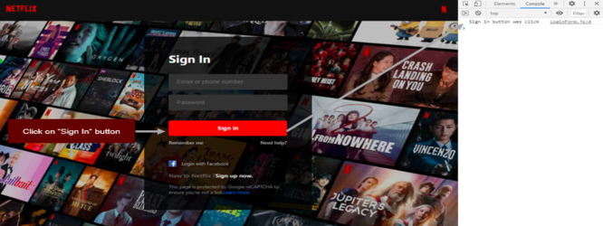
>
> - The next part is to get email and password from input fields and then send them to Firebase.

- Step 5: Replace the "Login Form" component with the following code.

```js
function LoginForm() {
  const login = () => {
    console.log("Sign in button was click");
  };

  const onEmailChanged = (e) => {
    const updatedEmail = e.target.value;
    console.log(`Updated email: ${updatedEmail}`);
  };

  const onPasswordChanged = (e) => {
    const updatedPassword = e.target.value;
    console.log(`Updated password: ${updatedPassword}`);
  };

  return (
    <div className="login-body">
      <div className="login-body__form">
        <h1>Sign In</h1>
        <div className="login-body__input mb-16">
          <input
            type="text"
            placeholder="Email or phone number"
            onChange={onEmailChanged}
          />
        </div>
        <div className="login-body__input">
          <input
            type="password"
            placeholder="Password"
            onChange={onPasswordChanged}
          />
        </div>
        <button className="login-body__submit-btn" onClick={login}>
          Sign In
        </button>
        <div className="login-body__options">
          <span>Remember me</span>
          <span className="login-body__need-help">Need help?</span>
        </div>
        <div className="login-body__footer">
          <div className="login-body__fb">
            
            <span>Login with Facebook</span>
          </div>
          <div className="login-body__new-to-nl">
            <span>New to Netflix ?</span>
            <span className="login-body__sign-up">Sign up now.</span>
          </div>
          <div className="login-body__google_captcha">
            This page is protected by Google reCAPTCHA to ensure you're not a
            bot.
            <span className="login-body__learn-more">Learn more.</span>
          </div>
        </div>
      </div>
    </div>
  );
}

export default LoginForm;
```

> 19th NOTE:
>
> - "onChanged={onEmailChanged}" was inserted to email field.
>
> - "onChanged={onPasswordChanged}" was inserted to password field.
>
> - "onEmailChanged" and "onPasswordChanged" were created.
>
> - When the current user inputs email. "onEmailChanged" will be triggered.
>
> - When the current user inputs password. "onPasswordChanged" will be triggered.
>
> - What is "e" ? React provides the concept of **Synthetic Event**.
>
> - SyntheticEvent is a cross-browser wrapper around the browser's native event. Its API is the same as the browser's native event, including stopPropagation() and preventDefault(), except the events work identically across all browsers.
>
> - The input's value can be get by using **e.target.value**
>
> - If you run the project, the result should look like this.
>
> 
>
> - When the current user is typing an email or password. We need to store those values somewhere else. We should store them in the state. It means that when the user changes the input's values, we will update the corresponding state.

- Step 6: Import "useState" and define "email" and "password" state.

```js
import { useState } from "react";
```

```js
function LoginForm() {
  ...
  const [email, setEmail] = useState();
  const [password, setPassword] = useState()
  ...
  const onEmailChanged = (e) => {
    const updatedEmail = e.target.value;
    setEmail(() => updatedEmail);
  };

  const onPasswordChanged = (e) => {
    const updatedPassword = e.target.value;
    setPassword(() => updatedPassword);
  };
  ...
}
```

> 20th NOTE:
>
> - Whenever we access the "email" state and "password" state, we can get the latest value.
>
> - The remaining task is to send those values to Firebase when the current user clicks on the "Sign In" button.

- Step 7: Import "firebaseAuth" from "firebase.js" file and then update "login" function to send "email" state and "password" state to Firebase.

```js
import { firebaseAuth } from "../../firebase/firebase";
```

```js
const login = () => {
  firebaseAuth
    .signInWithEmailAndPassword(email, password)
    .then((userCredential) => {
      // Signed in
      const user = userCredential.user;
      // ...
      console.log(`signed in user`);
      console.log(user);
    })
    .catch((error) => {
      console.log(error);
    });
};
```

> 21st NOTE:
>
> - if email and password are valid. Firebase would return the user's information and vice versa.
>
> - You can do anything you want with that value, for example, store the information in localStorage for use later or something like that.
>
> - In this case, we are trying to show the user's information on the console log.
>
> - If you run the code, your result should be like this.
>
> 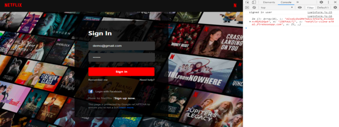

<a id="deploy-react-to-firebase"></a>

## **7. Deploy React to Firebase.**

It is time to make our project live on the internet. The following steps will describe how to deploy our application to Firebase.

- Step 1: Change directory to the project's folder and run "npm build" to build the production version of the project.

- Step 2: Go to the Firebase console and choose the "Hosting" option.

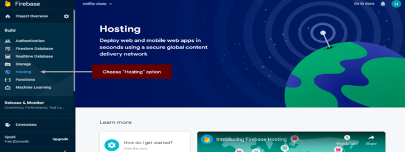

- Step 3: Click on the "Get started" button.

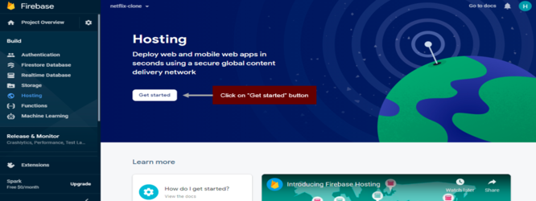

- Step 4: Change directory to the project's folder and run "npm install -g firebase-tools" and then click on the "Next" button.

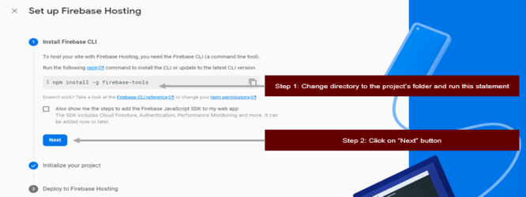

- Step 5: Change directory to the project's folder and run "firebase login" and "fire init".

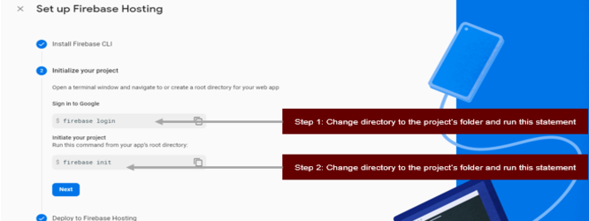


- Step 6: Deploy the application to Firebase by running "firebase deploy".

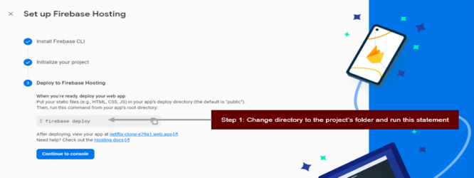


> Final NOTE:
>
> - Now you can access the URL on cmd to view your result.

<a id="summary"></a>

## **8. Summary**

- JSX (Javascript XML): helps us to write Javascript along with HTML.

- React Elements: describe what would be appeared on the screen.

- React Component: Small pieces of UI which could be reusable and combined to build the application.

- useEffect: performs side effects in the application, for example, interacting with the APIs, executing asynchronous operations, and so on.

- useState: defines the state in the application.

- Props: passed from the parent component to the child component, its syntax is similar to HTML attribute.

- React Router: useful routing library that can be used to navigate between pages.

Thank you so much for taking the course. I hope that you could understand important concepts in React and you can build many real-life projects by using React (as front-end) and Firebase (as back-end) to solve many problems and make our life become better.

<a id="useful-resources"></a>

## **9. Useful Resources.**

[1]. https://reactjs.org/docs/getting-started.html.

<a id="references"></a>

## **10. References**

[1]. https://reactjs.org/docs/getting-started.html. \
[2]. https://firebase.google.com/docs/database. \
[3]. https://firebase.google.com/docs/auth/web/password-auth. \
[4]. https://firebase.google.com/docs/hosting.
